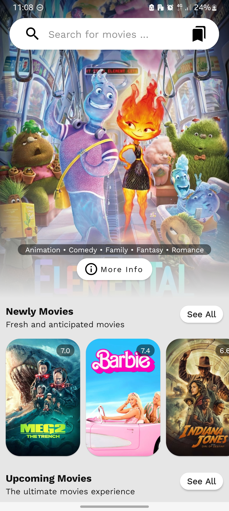
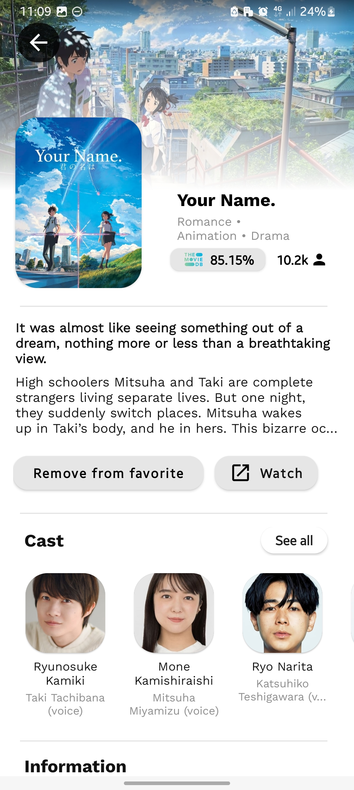
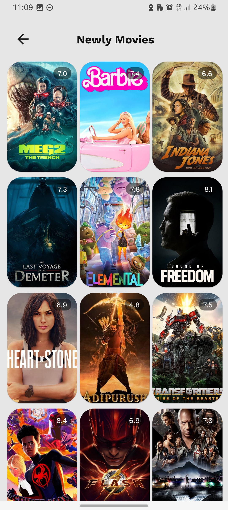
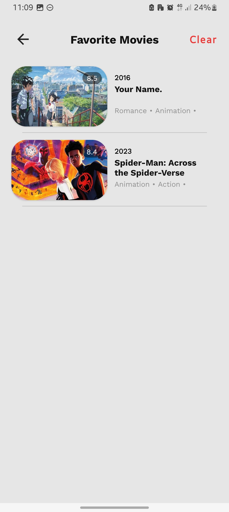

<p align="left">
<a href="https://github.com/gusentanan/moviee/actions/workflows/build.yaml">
</a>

# Moviee App
<table>
  <tr>
    <td>
       
    <p>This app is a movie browsing platform that follows MVVM and Clean Architecture principles. It features different movie categories, search function, and the ability to save favorite movies. Detailed movie pages provide comprehensive information about each film, including plot, cast, reviews, release date, and trailer.
      </p>
    </td>
  </tr>
</table>
<table>
  
<table>
  <tr>
     <td>Home</td>
     <td>Detail</td>
     <td>All Movie</td>
  </tr>
  <tr>
    <td></td>
    <td></td>
    <td></td>
  </tr>
  <tr>
    <td></td>
    <td></td>
  </tr>
   <td>Search</td>
  <td>Favoritee</td>
 </table>
 
## Feature List
```
├── Display different movie category (Upcoming, Popular, Top Rated etc)
├── Display detail movie information (Rating, Runtime, Cast, Trailer etc)
├── Save & Delete favorite movie
├── Search movie 
```
 
## Architecture
The architecture of this app is complies with each of 3 following points:
- [Model-View-ViewModel (MVVM)](https://proandroiddev.com/understanding-mvvm-pattern-for-android-in-2021-98b155b37b54) by utilizing the ViewModel in this architecture, you can achieve a more modular, testable, and maintainable codebase, with improved separation of concerns and a clear distinction between UI and business logic/data operations.
- [Modular app architecture](https://developer.android.com/topic/modularization) enables the development of features in isolation, independent of other features. This approach offers benefits such as reusability, scalability, maintainability, reduced app size, and easier modification or replacement of specific features. 
- [Clean Architecture](https://proandroiddev.com/kotlin-clean-architecture-1ad42fcd97fa) strictly emphasizes a clear separation of concerns through distinct architectural layers: Presentation/UI layer, Domain layer, and Data layer. This separation facilitates writing tests without dependencies on external frameworks or UI components, enhancing testability.

## Modules
<table>
  <td></td>
</table>

Above graph shows the app modular structure.
- The `:app` module has a direct dependency on the `:core` module. Additionally, `:app` indirectly depends on the `:feature` module 
- `:feature` modules depends on `:core`, and `utility`.
- Both `:core` and `:app` modules may have dependencies on the `:utility` module, but only if there is a need for specific utilities.
- The `:utility` module does not have any external dependencies.
<br></br>
This architecture promotes modularity and encapsulation by separating functionality into distinct modules. It allows for easier maintenance, reuse of modules across projects, and better management of dependencies between modules.

## Tech Stack
| Dependencies     | Description                                                                                                                                    |
|----------------  |------------------------------------------------------------------------------------------------------------------------------------------------|
|`Androidx`        | provides a set of libraries and components that offer backward compatibility, enhanced functionality, and ease of development for Android apps.|
|`Material`        | implifies the process of creating visually appealing and consistent user interfaces.                                                           |
|`LiveData`        | allows you to store and observe data in a way that automatically updates the UI when the data changes.                                         |
|`LifeCycle`       | offers lifecycle-aware components and callbacks that allow developers to handle common lifecycle events.                                       |
|`ViewModel`       | allows you to store and manage data that is independent of the UI lifecycle, ensuring that data is retained even during screen rotations or other configuration changes.                                                                                                                                              |
|`RxJava2`         | for doing asynchronous and executing event-based programs by using observable sequences.                                                       |
|`Retrofit2`       | construct the REST APIs and paging network data.                                                                                               |
|`Moshi`           | modern JSON library for Kotlin and Java.                                                                                                       |
|`Room`            | construct a DB by creating an abstract layer on top of SQLite, which enables smooth and effortless access to the database.                     |
|`Glide`           |library for Android that simplifies the process of loading and displaying images from network.                                                  |
|`Koin`            | a dependency injection framework that facilitates the management and resolution of dependencies.                                               |
|`Timber`          |a logger with a small, extensible API.                                                                                                          |
|`Shimmer`         |simplifies the implementation of shimmering effects, enhancing the user experience and providing visual feedback during content loading.        |
|`Mockito`         |mocking framework that allows for the creation of mock objects in unit testing.                                                                 |
|`JUnit`           |simplifies the process of writing and running tests, allowing developers to verify the correctness of their code and catch potential issues early in the development cycle.                                                                                                                                                  |
| and a lot more   |

## How to use it ? 
Clone this repository and make sure you're using the latest version of Android Studio
- Run the project using
  
  ```sh
  ./gradlew assembleDebug
  ```
  
-----------------
Feel free to contribute to this project & I Hope you found this repository useful 
### Thanks!😄
